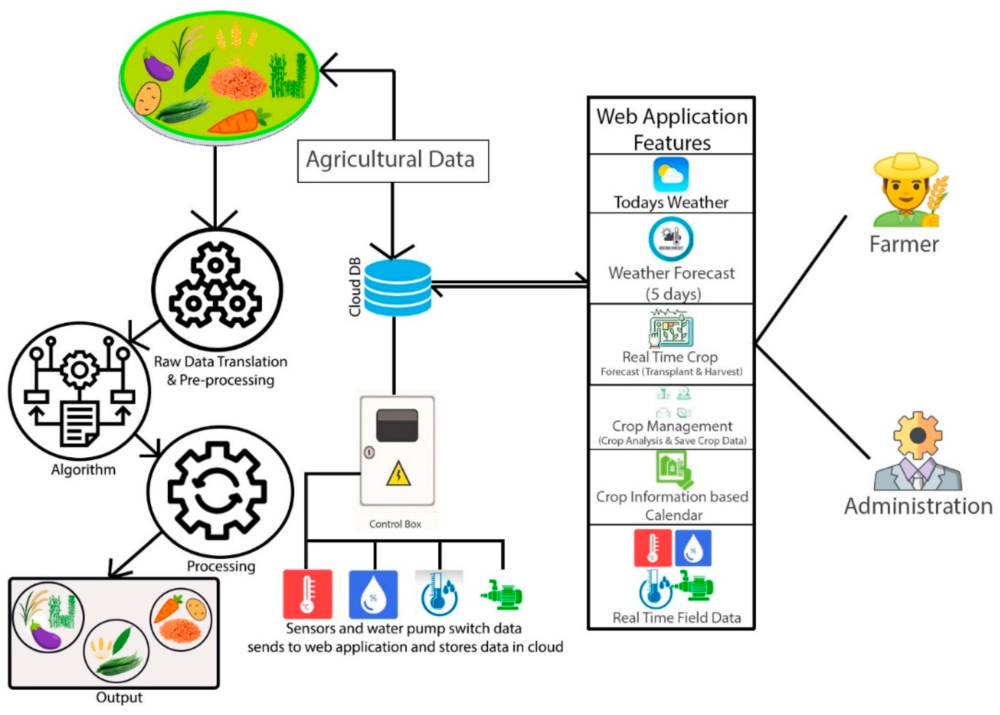

# Smart India Hackathon Workshop
# Date:24.09.2025
## Register Number:25017315
## Name:Padma Lakshmi G
## Problem Title
SIH 25010: Smart Crop Advisory System for Small and Marginal Farmers
## Problem Description
A majority of small and marginal farmers in India rely on traditional knowledge, local shopkeepers, or guesswork for crop selection, pest control, and fertilizer use. They lack access to personalized, real-time advisory services that account for soil type, weather conditions, and crop history. This often leads to poor yield, excessive input costs, and environmental degradation due to overuse of chemicals. Language barriers, low digital literacy, and absence of localized tools further limit their access to modern agri-tech resources.

Impact / Why this problem needs to be solved

Helping small farmers make informed decisions can significantly increase productivity, reduce costs, and improve livelihoods. It also contributes to sustainable farming practices, food security, and environmental conservation. A smart advisory solution can empower farmers with scientific insights in their native language and reduce dependency on unreliable third-party advice.

Expected Outcomes

• A multilingual, AI-based mobile app or chatbot that provides real-time, location-specific crop advisory.
• Soil health recommendations and fertilizer guidance.
• Weather-based alerts and predictive insights.
• Pest/disease detection via image uploads.
• Market price tracking.
• Voice support for low-literate users.
• Feedback and usage data collection for continuous improvement.

Relevant Stakeholders / Beneficiaries

• Small and marginal farmers
• Agricultural extension officers
• Government agriculture departments
• NGOs and cooperatives
• Agri-tech startups

Supporting Data

• 86% of Indian farmers are small or marginal (NABARD Report, 2022).
• Studies show ICT-based advisories can increase crop yield by 20–30%.

## Problem Creater's Organization
Government of Punjab

## Theme
Agriculture, FoodTech & Rural Development

## Proposed Solution
1. Lack of timely and personalized crop guidance

2. Inadequate access to weather, soil, and pest information

3. Poor linkage to markets and government schemes

## Diagram:

## Technical Approach
1. Real-time dashboard for system administrators.

2. Analytics on app usage, crop trends, and alert effectiveness.

3. Farmer feedback loop to improve advisory accuracy and AI model performance.

## Feasibility and Viability
1. Training and awareness programs can improve adoption.

2. Partnerships with local agricultural extension officers and NGOs facilitate reach.

3. Scalable architecture supports phased rollout and regional expansion.

## Impact and Benefits
1. Increases crop yield through data-driven decisions

2. Reduces crop losses with real-time alerts (pests, diseases, weather)

3. Enhances income stability and reduces financial risk

## Research and References
1. Machine Learning algorithms like Random Forest and XGBoost are effective for crop recommendation based on soil and climate data.

2. AI-powered pest and disease detection using image recognition (CNN) achieves high accuracy in early identification.

3. Agro-climatic planning helps farmers save costs and improves resilience to weather changes.